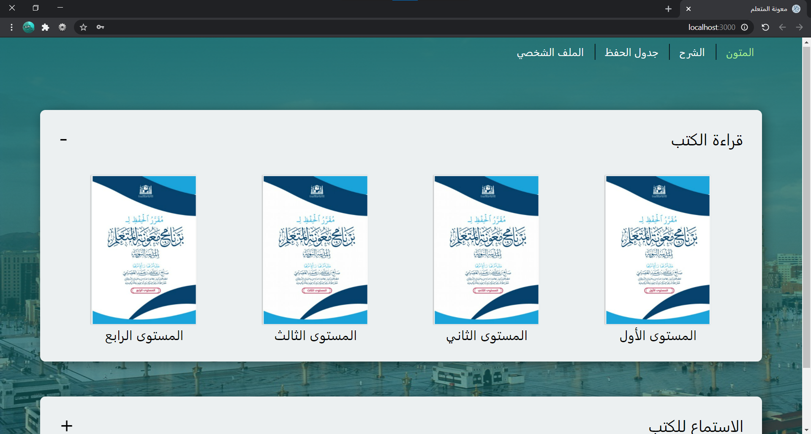
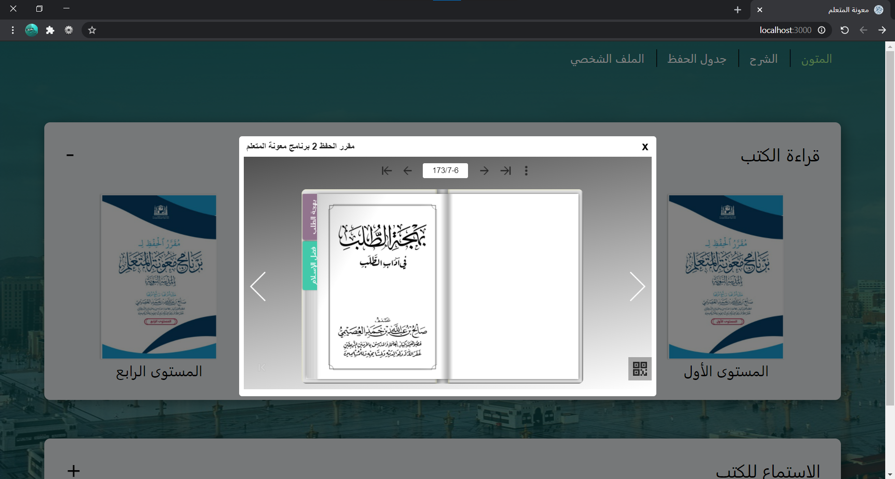
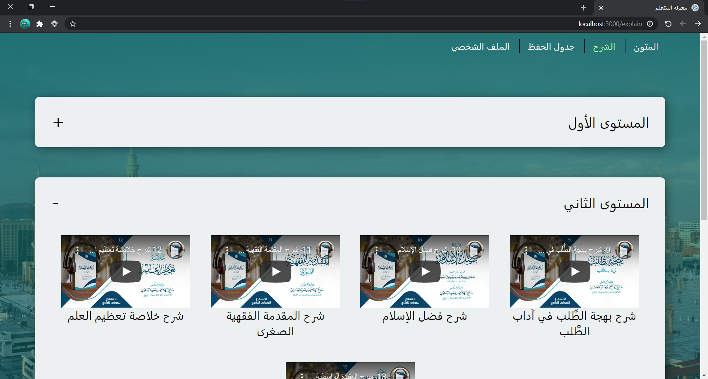
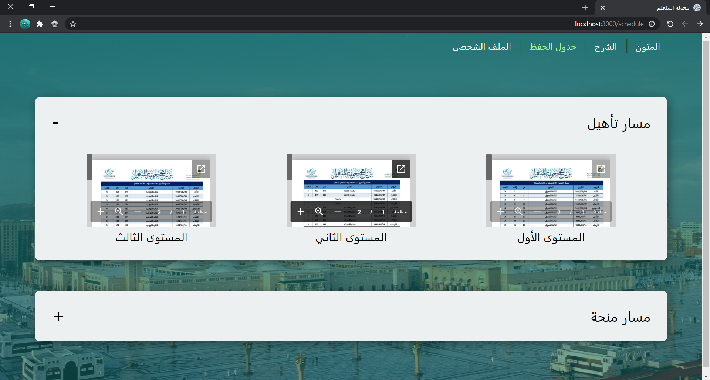
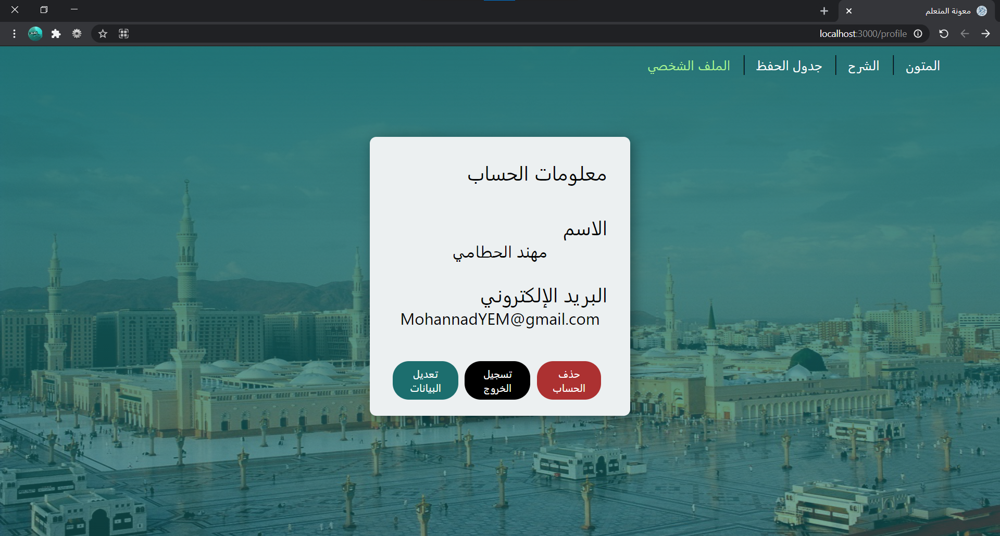

<h1 dir="rtl">متون</h1>

<h2 dir="rtl">موقع متون هو موقع يُعنى بجمع مقررات برنامج معونة المتعلم القائم في مدينة رسول الله صلى الله عليه وسلم</h2>

<h2 dir="rtl">ويحتوي هذا الموقع على جميع ما يحتاجه الطالب في هذا البرنامج بشكل مرتب في عدة أقسام حيث يحتوي على :</h2>

<ol  dir="rtl">
  <li><h3>متون الحفظ كاملة (قراءة واستماع)</h3>
    
  </li> 
  <li><h3>الشروح مسموعة للشيخ صالح العصيمي</h3>
    
  </li> 
  <li><h3>الجداول الخاصة بكل مستوى للمسارين منحة وتأهيل</h3>
    
  </li> 
  <li><h3>ملف خاص لكل طالب</h3>
    
  </li>
</ol> 

